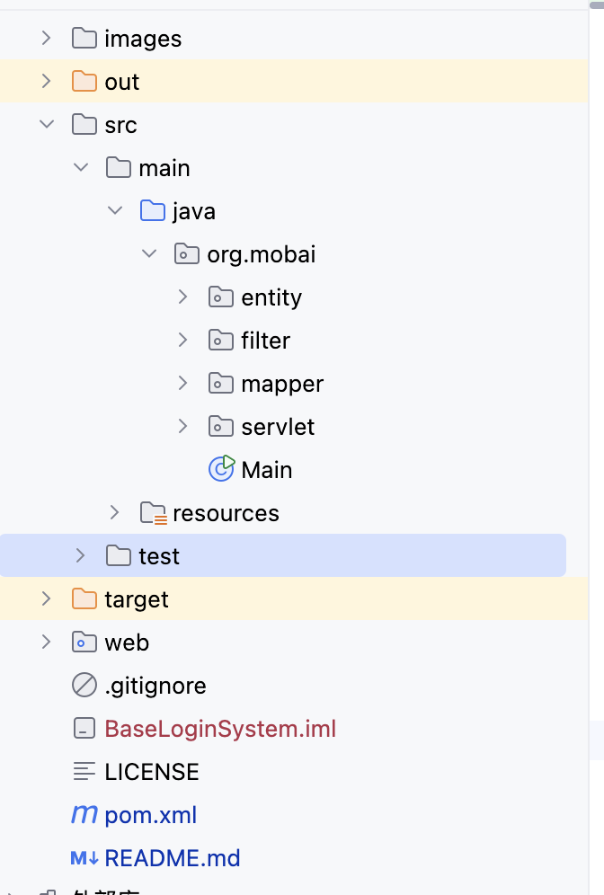
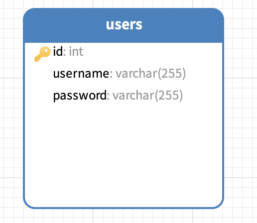
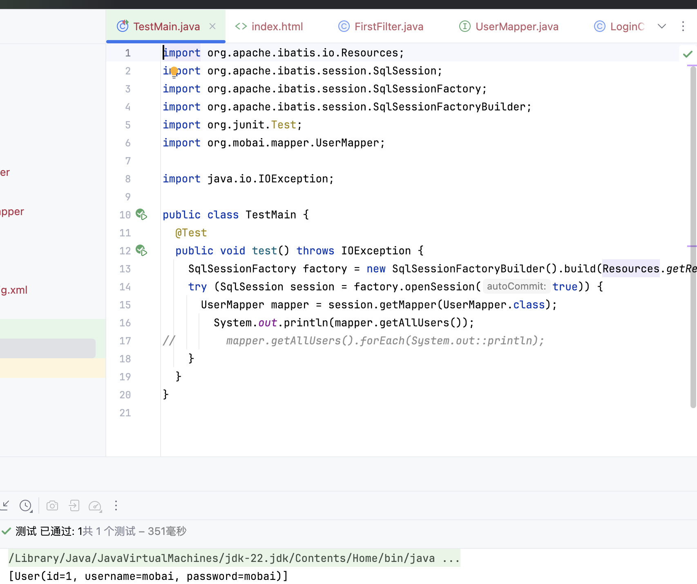
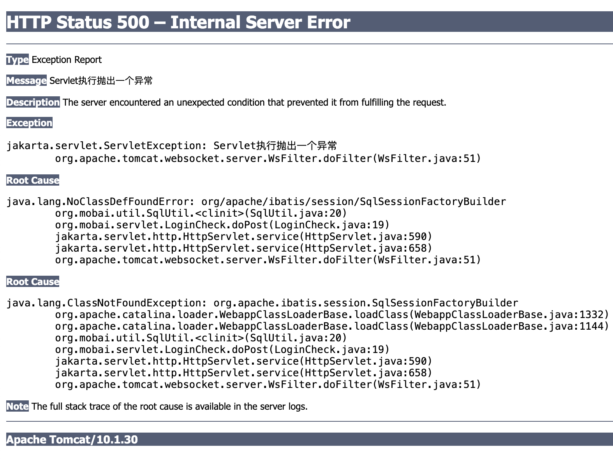

# 基础登陆系统

> 看Servlet有感而发，感觉完全可以根据流程做一个稍微功能完善的登陆系统，当然，只强调登陆，先不考虑其他的。

> 核心目的是强化下Servlet，Cookie和Session的基本流程

> 可以开始写流程了，先流程/步骤，哪里不会再核心强化哪里即可

技术栈：

- Servlet
- Mybatis
- common-io
- Tomcat
- Lombok
- Maven

前端+后端

> 前端就不整什么高大上的界面了，实现核心登陆系统即可，数据库使用本地数据库，之后测试再整理到远程数据库中。

关于一个idea使用教程：

建立一个空文件夹，使用idea打开该文件夹，然后移除自动生成的模块，然后新建立模块即可将该空文件夹改为maven等项目文件夹。

## 1.项目创建

项目大体架构如下：




使用maven导入依赖

- mybatis
- lombok
- servlet
- mysql

要创建web项目直接添加web工件即可

配置Tomcat服务器，注意在部署处修改URL


添加web基础页面

index.html

```html
<!DOCTYPE html>
<html lang="en">
<head>
    <meta charset="UTF-8">
    <title>Mobai</title>
    <link href="style.css" rel="stylesheet">
    <script src="test.js"></script>
</head>
<body>
<h1>登录到系统</h1>
<form method="post" action="test">
    <hr>
    <div>
        <label>
            <input type="text" placeholder="用户名" name="username">
        </label>
    </div>
    <div>
        <label>
            <input type="password" placeholder="密码" name="password">
        </label>
    </div>
    <div>
        <button class="myButton">登录</button>
    </div>
</form>
</body>
</html>
```

style.css

```css
body {
    display: flex;
    align-items: center;
    height: 100vh;
    margin: 0;
    flex-direction: column;
}

.main {
    display: flex;
    flex-direction: column;
    align-items: center;
    justify-content: center;
}

input {
    padding: 10px;
    margin: 10px;
    border-radius: 5px;
    border: 1px solid #ccc;
}

form {
    display: flex;
    flex-direction: column;
    align-items: center;
}

form div {
    width: 100%;
    display: flex;
    justify-content: center;
}


.myButton {
    margin-top: 20px;
    padding-left: 30px;
    padding-right: 30px;
    border: 1px solid #ccc;
    background-color: #4CAF50;
    color: white;
    font-size: 1em;
    border-radius: 10px;
}
```

test.js

```js
function updateTime() {
    let xhr = new XMLHttpRequest();
    xhr.onreadystatechange = function () {
        if (xhr.readyState === 4 && xhr.status === 200) {
            document.getElementById("time").innerText = xhr.responseText
        }
    };
    xhr.open('GET', 'time', true);
    xhr.send();
}
```

## 2.配置数据库和Mybatis

数据库模型如下，比较简单就不过多赘述了



注解复制xml文件创建mybaits-config.xml

```xml
<?xml version="1.0" encoding="UTF-8" ?>
<!DOCTYPE configuration
        PUBLIC "-//mybatis.org//DTD Config 3.0//EN"
        "http://mybatis.org/dtd/mybatis-3-config.dtd">
<configuration>
    <environments default="development">
        <environment id="development">
            <transactionManager type="JDBC"/>
            <dataSource type="POOLED">
                <property name="driver" value="com.mysql.cj.jdbc.Driver"/>
                <property name="url" value="jdbc:mysql://localhost:3306/BaseLoginSystem"/>
                <property name="username" value="root"/>
                <property name="password" value="mobaisilent"/>
            </dataSource>
        </environment>
    </environments>
    <mappers>
        <mapper class="org.mobai.mapper.UserMapper"/>
    </mappers>
</configuration>
```

> 关于未注册DTD
>
> http://mybatis.org/dtd/mybatis-3-config.dtd
>
> 按照提示打开对应设置进行添加即可

## 3.创建实体和数据库连接测试

user

- int id
- String username
- String password


UserMapper如下

```java
package org.mobai.mapper;

import org.apache.ibatis.annotations.Select;
import org.mobai.entity.User;

import java.util.List;

public interface UserMapper {
  @Select("select * from users")
  List<User> getAllUsers();
}
```

> 这里只是测试打印所有用户对象


测试结果如下



> 创建mapper
>
> SqlSessionFactory -> SqlSession -> UserMapper

数据库测试成功。

将上面的SQL操作转为工具类

```java
package org.mobai.util;

import org.apache.ibatis.io.Resources;
import org.apache.ibatis.session.SqlSession;
import org.apache.ibatis.session.SqlSessionFactory;
import org.apache.ibatis.session.SqlSessionFactoryBuilder;
import org.mobai.mapper.UserMapper;

import java.io.IOException;
import java.util.function.Consumer;

public class SqlUtil {
  private SqlUtil() {
  }

  private static SqlSessionFactory factory;

  static {
    try {
      factory = new SqlSessionFactoryBuilder().build(Resources.getResourceAsStream("mybaits-config.xml"));
    } catch (IOException e) {
      throw new RuntimeException(e);
    }
  }

  public static void doSql(Consumer<UserMapper> consumer) {
    try (SqlSession session = factory.openSession(true)) {
      UserMapper mapper = session.getMapper(UserMapper.class);
      consumer.accept(mapper);
    }
  }
}
```

> SqlUtil.doSql(mapper -> mapper.getAllUsers().forEach(System.out::println));

ok，测试成功

## 4.创建路由

> 实际写起来会发现到处碰壁

在LoginChick中

```java
@WebServlet("/loginCheck")
public class LoginCheck extends HttpServlet {
  @SneakyThrows
  @Override
  protected void doPost(HttpServletRequest req, HttpServletResponse resp) {
    String username = req.getParameter("username");
    String password = req.getParameter("password");
    System.out.println(username + " " + password);
    SqlUtil.doSql(mapper -> {
      User user = mapper.userCheck(username, password);
      System.out.println(user);
    });
  }
}			
```

> 非常合理但是报错如下：很简单的数据库查询操作，查询输入用户是否在数据库中存在



简单说就是为找到SqlSessionFactoryBuilder类，但是显然我的maven项目中导入了该类，不使用SqlUtil依旧无效


​	


## Cookie设置


## Session设置


