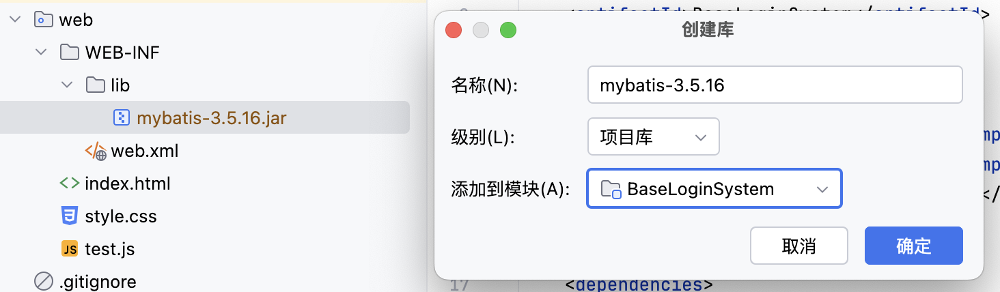
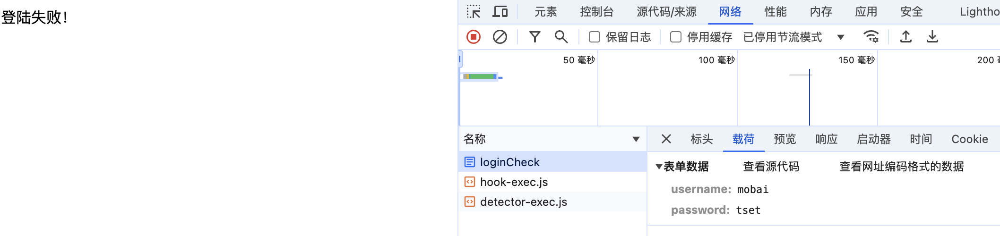
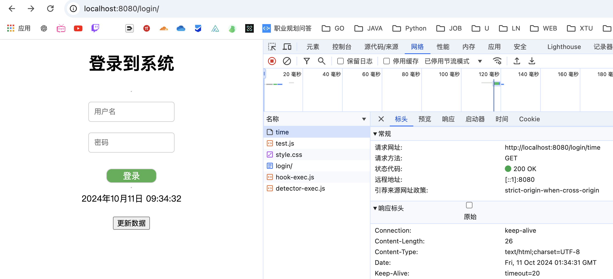
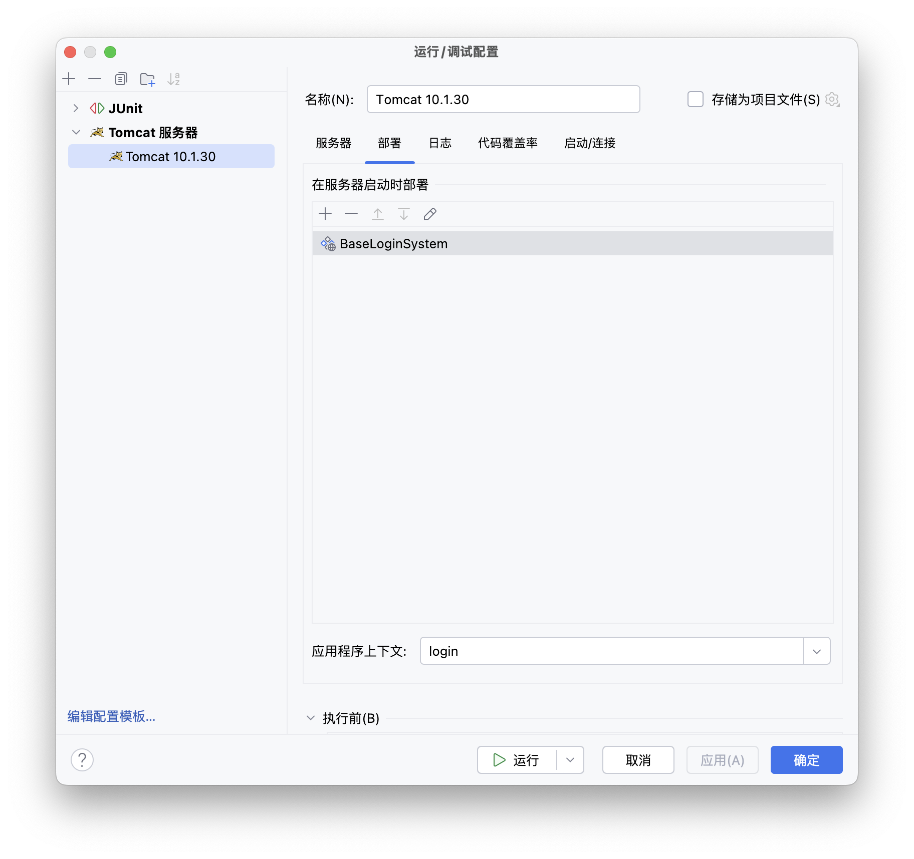
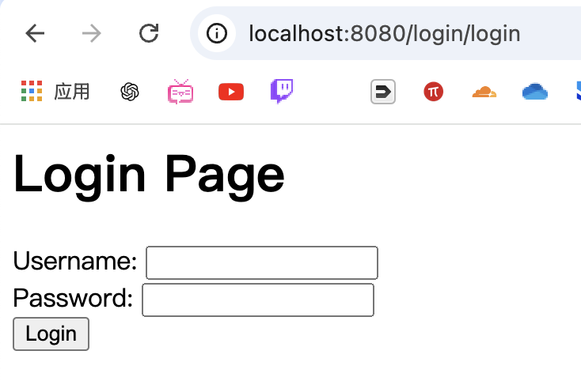
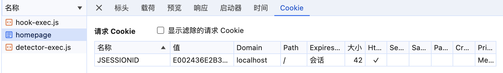
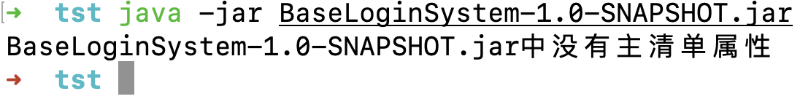
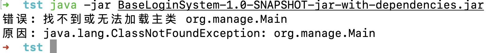
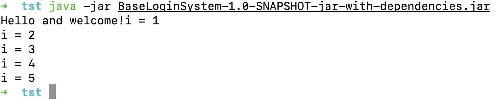

# 基础登陆系统

> 看Servlet有感而发，感觉完全可以根据流程做一个稍微功能完善的登陆系统，当然，只强调登陆，先不考虑其他的。

> 核心目的是强化下Servlet，Cookie和Session的基本流程

> 可以开始写流程了，先流程/步骤，哪里不会再核心强化哪里即可

技术栈：

- Servlet
- Mybatis
- common-io
- Tomcat
- Lombok
- Maven

前端+后端

> 前端就不整什么高大上的界面了，实现核心登陆系统即可，数据库使用本地数据库，之后测试再整理到远程数据库中。

关于一个idea使用教程：

建立一个空文件夹，使用idea打开该文件夹，然后移除自动生成的模块，然后新建立模块即可将该空文件夹改为maven等项目文件夹。

## 1.项目创建

项目大体架构如下：


使用maven导入依赖

- mybatis
- lombok
- servlet
- mysql

要创建web项目直接添加web工件即可

配置Tomcat服务器，注意在部署处修改URL


添加web基础页面

index.html

```html
<!DOCTYPE html>
<html lang="en">
<head>
    <meta charset="UTF-8">
    <title>Mobai</title>
    <link href="style.css" rel="stylesheet">
    <script src="test.js"></script>
</head>
<body>
<h1>登录到系统</h1>
<form method="post" action="test">
    <hr>
    <div>
        <label>
            <input type="text" placeholder="用户名" name="username">
        </label>
    </div>
    <div>
        <label>
            <input type="password" placeholder="密码" name="password">
        </label>
    </div>
    <div>
        <button class="myButton">登录</button>
    </div>
</form>
</body>
</html>
```

style.css

```css
body {
    display: flex;
    align-items: center;
    height: 100vh;
    margin: 0;
    flex-direction: column;
}

.main {
    display: flex;
    flex-direction: column;
    align-items: center;
    justify-content: center;
}

input {
    padding: 10px;
    margin: 10px;
    border-radius: 5px;
    border: 1px solid #ccc;
}

form {
    display: flex;
    flex-direction: column;
    align-items: center;
}

form div {
    width: 100%;
    display: flex;
    justify-content: center;
}


.myButton {
    margin-top: 20px;
    padding-left: 30px;
    padding-right: 30px;
    border: 1px solid #ccc;
    background-color: #4CAF50;
    color: white;
    font-size: 1em;
    border-radius: 10px;
}
```

test.js

```js
function updateTime() {
    let xhr = new XMLHttpRequest();
    xhr.onreadystatechange = function () {
        if (xhr.readyState === 4 && xhr.status === 200) {
            document.getElementById("time").innerText = xhr.responseText
        }
    };
    xhr.open('GET', 'time', true);
    xhr.send();
}
```

## 2.配置数据库和Mybatis

数据库模型如下，比较简单就不过多赘述了


注解复制xml文件创建mybaits-config.xml

```xml
<?xml version="1.0" encoding="UTF-8" ?>
<!DOCTYPE configuration
        PUBLIC "-//mybatis.org//DTD Config 3.0//EN"
        "http://mybatis.org/dtd/mybatis-3-config.dtd">
<configuration>
    <environments default="development">
        <environment id="development">
            <transactionManager type="JDBC"/>
            <dataSource type="POOLED">
                <property name="driver" value="com.mysql.cj.jdbc.Driver"/>
                <property name="url" value="jdbc:mysql://localhost:3306/BaseLoginSystem"/>
                <property name="username" value="root"/>
                <property name="password" value="mobaisilent"/>
            </dataSource>
        </environment>
    </environments>
    <mappers>
        <mapper class="org.mobai.mapper.UserMapper"/>
    </mappers>
</configuration>
```

> 关于未注册DTD
>
> http://mybatis.org/dtd/mybatis-3-config.dtd
>
> 按照提示打开对应设置进行添加即可

## 3.创建实体和数据库连接测试

user

- int id
- String username
- String password


UserMapper如下

```java
package org.mobai.mapper;

import org.apache.ibatis.annotations.Select;
import org.mobai.entity.User;

import java.util.List;

public interface UserMapper {
  @Select("select * from users")
  List<User> getAllUsers();
}
```

> 这里只是测试打印所有用户对象


测试结果如下


> 创建mapper
>
> SqlSessionFactory -> SqlSession -> UserMapper

数据库测试成功。

将上面的SQL操作转为工具类

```java
package org.mobai.util;

import org.apache.ibatis.io.Resources;
import org.apache.ibatis.session.SqlSession;
import org.apache.ibatis.session.SqlSessionFactory;
import org.apache.ibatis.session.SqlSessionFactoryBuilder;
import org.mobai.mapper.UserMapper;

import java.io.IOException;
import java.util.function.Consumer;

public class SqlUtil {
  private SqlUtil() {
  }

  private static SqlSessionFactory factory;

  static {
    try {
      factory = new SqlSessionFactoryBuilder().build(Resources.getResourceAsStream("mybaits-config.xml"));
    } catch (IOException e) {
      throw new RuntimeException(e);
    }
  }

  public static void doSql(Consumer<UserMapper> consumer) {
    try (SqlSession session = factory.openSession(true)) {
      UserMapper mapper = session.getMapper(UserMapper.class);
      consumer.accept(mapper);
    }
  }
}
```

> SqlUtil.doSql(mapper -> mapper.getAllUsers().forEach(System.out::println));

ok，测试成功

## 4.创建路由

> 实际写起来会发现到处碰壁

在LoginChick中

```java
@WebServlet("/loginCheck")
public class LoginCheck extends HttpServlet {
  @SneakyThrows
  @Override
  protected void doPost(HttpServletRequest req, HttpServletResponse resp) {
    String username = req.getParameter("username");
    String password = req.getParameter("password");
    System.out.println(username + " " + password);
    SqlUtil.doSql(mapper -> {
      User user = mapper.userCheck(username, password);
      System.out.println(user);
    });
  }
}			
```

> 非常合理但是报错如下：很简单的数据库查询操作，查询输入用户是否在数据库中存在


简单说就是为找到SqlSessionFactoryBuilder类，但是显然我的maven项目中导入了该类，不使用SqlUtil依旧无效

出错代码为：factory=new SqlSessionFactoryBuilder().build(in);
将该代码单独提出来，运行没有问题，启动tomcat运行出错

解决：包加载问题
1、将lib库文件夹放置到web/WEB_INF 目录下

2、选择lib，右键，点击add as library,将lib库加载到项目库中，让程序识别

3、重新启动tomcat，解决。

>  直接将Mybais包导入到webapp里面的lib中让webapp识别
>
>  右键lib，添加为库 add as library

	

> 问题成功解决，像这种情况直接将问题复制到Google上搜索处理速度更快，对问题的针对性是比ChatGPT更好的

> 同样的问题用同样的解决方式了

`java.lang.ClassNotFoundException: Cannot find class: com.mysql.cj.jdbc.Driver`

所以是建议webapp项目手动导入jar包

问题成功解决，方法都是web项目手动导入jar包（原因应该是maven导入的jar包无法自动导入到webapp工件？	



> 数据库查询登陆功能已实现

CheckLogin -> HomePage

实现登陆之后到达主页，然后在Login界面进行SessionCheck，如果符合条件允许直接跳转到主页免登陆

> web项目记得重启Tomcat服务器更新实现资源


## 5.添加Time

TimeServlet.java

```java
package org.mobai.servlet;

import jakarta.servlet.ServletException;
import jakarta.servlet.annotation.WebServlet;
import jakarta.servlet.http.HttpServlet;
import jakarta.servlet.http.HttpServletRequest;
import jakarta.servlet.http.HttpServletResponse;

import java.io.IOException;
import java.text.SimpleDateFormat;
import java.util.Date;

@WebServlet("/time")
public class TimeServlet extends HttpServlet {

  @Override
  protected void doGet(HttpServletRequest req, HttpServletResponse resp) throws ServletException, IOException {
    SimpleDateFormat dateFormat = new SimpleDateFormat("yyyy年MM月dd日 HH:mm:ss");
    String date = dateFormat.format(new Date());
    resp.setContentType("text/html;charset=UTF-8");
    resp.getWriter().write(date);
  }
}
```



加载该页面的同时 直接加载了http://localhost:8080/login/time

注意理解这种相对路径的关系

> Servlet有一种非常明确的相对路径关系，大多都是处理基于该界面的相对路径，后面再接上相对路径，感觉处理不是很明确

## 6.多次刷新间歇性出现412错误

方法一：
清缓存，这样第二次访问的时候就不会有If-Modified-Since和If-None-Match被传过去了。

用户自然不会手动清除缓存，所以我们在后台加禁止浏览器缓存。

```java
resp.setHeader( "Cache-Control" , "no-store" );   
resp.setDateHeader( "Expires" , 0); 
resp.setHeader( "Pragma" , "no-cache" );
```

不过静止用户缓存这个方法大大增加了服务器的压力，所以可以选择第二种方法。

方法二：
在web.xml中添加error-page标签，按照错误号指定跳转。出现错误号为412则跳转到login.jsp（也可以改成别的页面，随自己的想法）

我顺便还把别的没捕捉的异常也一块处理了，反正有错就重新登录。

```java
  <error-page>
    <error-code>412</error-code>
    <location>/login.jsp</location>
  </error-page>
  <error-page>
    <exception-type>java.lang.Exception</exception-type>
    <location>/login.jsp</location>
  </error-page>
```

## 7.关于配置的Servlet不生效

问题描述：

配置的启动界面(定位到index.html)的url是http://localhost:8080/login

但是配置的Servlet("/login")不生效，但是访问http://localhost:8080/login/login生效

```txt
1. 确保项目正确部署
首先，确保你的项目已正确部署到Tomcat服务器，并且Tomcat服务器正在运行。

2. 检查Tomcat日志
查看Tomcat的日志文件（如 catalina.out），确保没有任何错误或警告信息。如果有错误信息，请根据错误信息进行相应的修复。

3. 确保URL正确
确保你访问的URL是 http://localhost:8080/your-context-path/login，其中 your-context-path 是你的应用程序的上下文路径。如果你的应用程序部署在根上下文路径下，则URL应为 http://localhost:8080/login。

4. 检查 web.xml 配置
虽然你使用了 @WebServlet 注解，但确保 web.xml 中没有与 "/login" 路径冲突的配置。

5. 确保 SqlUtil 类正确实现
确保 SqlUtil 类和 userCheck 方法正确实现，并且能够正常工作。
```

注意解决方法中提到的上下文路径

见Tomcat中的设置



> 可见这个上下文应该修改下

如果我将上下文路径改为http://localhost:8080/

按照GPT的说法，写一个Servlet("/")即可实现代理该界面。

经过实测，发现初始上下文是http://localhost:8080/login

写一个@WebServlet("/login")的生效形式如下：



```java
package org.mobai.servlet;

import jakarta.servlet.ServletException;
import jakarta.servlet.annotation.WebServlet;
import jakarta.servlet.http.HttpServlet;
import jakarta.servlet.http.HttpServletRequest;
import jakarta.servlet.http.HttpServletResponse;

import java.io.IOException;
import java.io.PrintWriter;

@WebServlet("/login")
public class LoginServlet extends HttpServlet {
  private static final long serialVersionUID = 1L;

  @Override
  protected void doGet(HttpServletRequest request, HttpServletResponse response) {
    // 处理GET请求，显示登录页面
    System.out.println("Here");
    response.setContentType("text/html;charset=UTF-8");
    try (PrintWriter out = response.getWriter()) {
      out.println("<html>");
      out.println("<head><title>Login Page</title></head>");
      out.println("<body>");
      out.println("<h1>Login Page</h1>");
      out.println("<form method='post' action='login'>");
      out.println("Username: <input type='text' name='username'><br>");
      out.println("Password: <input type='password' name='password'><br>");
      out.println("<input type='submit' value='Login'>");
      out.println("</form>");
      out.println("</body>");
      out.println("</html>");
    } catch (IOException e) {
      throw new RuntimeException(e);
    }
  }

  @Override
  protected void doPost(HttpServletRequest request, HttpServletResponse response) throws ServletException, IOException {
    String username = request.getParameter("username");
    String password = request.getParameter("password");
    if ("admin".equals(username) && "password".equals(password)) {
      response.sendRedirect(request.getContextPath() + "/homepage/");
    } else {
      response.sendRedirect(request.getContextPath() + "/login/?error=1");
    }
  }
}
```

所以想让/login这个初始上下文和/login这个Servlet相匹配还是有技术的

初始上下文是/login的话想要让/homepage生效也得是/login/homepage

> 可见Servlet:小服务程序
>
> 像是为上下文专门准备的
>
> 就单纯对某些页面的处理来说感觉并不是很灵活

就API接口角度来说不如SpringBoot

建议事添加前置界面 -> login界面 -> 主页

前置界面用来触发login的Check功能

问题解决的核心：

```java
  @Override
  protected void doGet(HttpServletRequest request, HttpServletResponse response) throws ServletException, IOException {
    // 转发请求到 login.html
    System.out.println("here GET请求 跳转到login.html");
    request.getRequestDispatcher("/login.html").forward(request, response);
//    核心就在这里
  }
```

> request.getRequestDispatcher("/login.html").forward(request, response);
>
> 靠这句实现localhost:8080/login代理login.html这个文件
>
> 如果是Tomcat主页面即代理login.html的话，/login无法实现代理主页面的请求，毕竟不能设置/这种范围极广的路由

配置的Tomcat的上下文是空，即localhost:8080/

下面这段代码是实现直接主路由直接重定向到localhost:8080/login

```java
<%@ page contentType="text/html;charset=UTF-8" language="java" %>
<html>
<head>
    <title>Prefix</title>
</head>
<body>
<% response.sendRedirect("login"); %>
</body>
</html>
```

> 直接重定向到/login

感觉同时解决了多个问题，终于能够实现页面和Servlet的匹配了

## 7.Cookie设置

在浏览器中保存一些信息，并且在下次请求时，请求头中会携带这些信息。

设置：

```java	
package org.mobai.servlet;

import jakarta.servlet.annotation.WebServlet;
import jakarta.servlet.http.Cookie;
import jakarta.servlet.http.HttpServlet;
import jakarta.servlet.http.HttpServletRequest;
import jakarta.servlet.http.HttpServletResponse;
import lombok.SneakyThrows;
import org.mobai.entity.User;
import org.mobai.util.SqlUtil;

import java.io.IOException;
import java.util.Arrays;
import java.util.Map;

@WebServlet("/homepage")
public class HomePage extends HttpServlet {
  @Override
  protected void doGet(HttpServletRequest req, HttpServletResponse resp) throws IOException {
    // 抵达get请求说明Cookie检验通过，那么相当于近期刚刚登陆，就直接重定向到了该界面，直接从Cookie中获取值即可
    System.out.println("这里是/homepage GET请求");
    resp.setContentType("text/html;charset=UTF-8");
    resp.getWriter().write("<h1>主页</h1><br>");
    Cookie[] cookies = req.getCookies();
    String username = null;
    for (Cookie cookie : cookies) {
      if (cookie.getName().equals("username")) username = cookie.getValue();
    }
    if (username == null) {
      resp.getWriter().write("<script>"
              + "if (confirm('Cookie/Session已失效，请重新登陆')) {"
              + "  window.location.href = 'login';"
              + "} else {"
              + "  window.location.href = 'login';"
              + "}"
              + "</script>");
    } else {
      resp.getWriter().write("登陆成功！" + username);
    }
  }

  @SneakyThrows
  @Override
  protected void doPost(HttpServletRequest req, HttpServletResponse resp) {
    System.out.println("here is homepage doPost");
//    doPost显然就是处理的Post请求，处理逻辑是只要是非空username和password就登陆成功
    resp.setContentType("text/html;charset=UTF-8");
    resp.getWriter().write("<h1>主页</h1><br>");
    //获取POST请求携带的表单数据
    Map<String, String[]> map = req.getParameterMap();
    String username = req.getParameter("username");
    String password = req.getParameter("password");
    if (map.containsKey("remember-me")) {   //若勾选了勾选框，那么会此表单信息 设置cookie
      Cookie cookie_username = new Cookie("username", username);
      cookie_username.setMaxAge(30);
      Cookie cookie_password = new Cookie("password", password);
      cookie_password.setMaxAge(30);
      resp.addCookie(cookie_username);
      resp.addCookie(cookie_password);
    }
    // map.containsKey("username") && map.containsKey("password") && map.get("username").length > 0 && map.get("password").length > 0
    //先获取Request里面的ParemeterMap然后判断表单是否完整
    if (!username.isEmpty() && !password.isEmpty()) {
      System.out.println(username + " " + password);
      SqlUtil.doSql(mapper -> {
        User user = mapper.userCheck(username, password);
        System.out.println(user);
        if (user != null) {
          req.getSession().setAttribute("user", user);
          try {
            resp.getWriter().write("登陆成功！");
          } catch (IOException e) {
            throw new RuntimeException(e);
          }
        } else {
          try {
            resp.getWriter().write("登陆失败！");
          } catch (IOException e) {
            throw new RuntimeException(e);
          }
        }
      });
      //权限校验（待完善）（之后会学到）
    } else {
      resp.getWriter().write("请输入用户名或者密码！");
    }
  }
}

```

检验：

```java	
package org.mobai.servlet;

import jakarta.servlet.ServletException;
import jakarta.servlet.annotation.WebServlet;
import jakarta.servlet.http.Cookie;
import jakarta.servlet.http.HttpServlet;
import jakarta.servlet.http.HttpServletRequest;
import jakarta.servlet.http.HttpServletResponse;
import org.mobai.util.SqlUtil;

import java.io.IOException;

@WebServlet("/login")
public class Login extends HttpServlet {
  @Override
  protected void doGet(HttpServletRequest req, HttpServletResponse resp) throws ServletException, IOException {
    Cookie[] cookies = req.getCookies();
    System.out.println("这里是/login cookies检验");
    String username = null;
    String password = null;
    for (Cookie cookie : cookies) {
      if (cookie.getName().equals("username")) username = cookie.getValue();
      if (cookie.getName().equals("password")) password = cookie.getValue();
    }
    if (username != null && password != null) {
      // 这才是Cookie的信息完整的情况
      String finalUsername = username;
      String finalPassword = password;
      System.out.println("username: " + finalUsername + " password: " + finalPassword);
      SqlUtil.doSql(mapper -> {
        if (mapper.userCheck(finalUsername, finalPassword) != null) {
          System.out.println("这里是/login cookies检验 直接免登陆 设置session");
          req.getSession().setAttribute("user", finalUsername);
          try {
            resp.setContentType("text/html;charset=UTF-8");
            resp.getWriter().write("<script>"
                    + "if (confirm('您已经登陆过了，点击确认到达主页，点击取消重新登陆')) {"
                    + "  window.location.href = 'homepage';"
                    + "} else {"
                    + "  document.cookie = 'username=; Max-Age=0';"
                    + "  document.cookie = 'password=; Max-Age=0';"
                    + "  window.location.href = 'login';"
                    + "}"
                    + "</script>");
          } catch (IOException e) {
            throw new RuntimeException(e);
          }
        }
      });
    } else {
      System.out.println("这里是/login GET请求 代理login.html");
      req.getRequestDispatcher("/login.html").forward(req, resp);
    }
  }

  @Override
  protected void doPost(HttpServletRequest req, HttpServletResponse resp) throws ServletException, IOException {
    System.out.println("这里是/login POST请求 跳转到GET");
    this.doGet(req, resp);
  }
}
```

这里记录几个chrome使用技巧：

```txt
1. 按/直接到达搜索框

2. 按command + 数字1，2，3，4直接进行标签页的切换

3. 按command + l 到达链接框

4. command + t 打开一个新的标签页

5. command + 左/右键 实现同标签页的前进和后退
```

## 8.Session设置

用于让服务器确实浏览器是属于哪个回话，默认报错30分钟。



设置：

```java
HttpSession session = req.getSession();
String user= (String) session.getAttribute("user");
```

检验：

```java
HttpSession session = req.getSession();
String user= (String) session.getAttribute("user");
if(user == null) {
  resp.sendRedirect("login");
  return;
}
```

## 9.Filter

@WebFilter("/*")   //路径的匹配规则和Servlet一致，这里表示匹配所有请求。

只要这个路径匹配，这个过滤器就出触发。

```java
package org.mobai.filter;

import jakarta.servlet.FilterChain;
import jakarta.servlet.ServletException;
import jakarta.servlet.annotation.WebFilter;
import jakarta.servlet.http.HttpServletRequest;
import jakarta.servlet.http.HttpServletResponse;
import jakarta.servlet.http.HttpSession;
import jakarta.servlet.http.HttpFilter;
import org.mobai.entity.User;

import java.io.IOException;

// 像这种过滤器/* 太广泛了，只是测试用 把这个就先注释了。
//@WebFilter("/*")
public class MainFilter extends HttpFilter {
  @Override
  protected void doFilter(HttpServletRequest req, HttpServletResponse res, FilterChain chain) throws IOException, ServletException {
    String url = req.getRequestURL().toString();
    System.out.println("Flag1 is MainFilter");
    //判断是否为静态资源
    if(!url.endsWith(".js") && !url.endsWith(".css") && !url.endsWith(".png")){
      HttpSession session = req.getSession();
      User user = (User) session.getAttribute("user");
      //判断是否未登陆
      if(user == null && !url.endsWith("login")){
        System.out.println("Flag2 is MainFilter");
        res.sendRedirect("login");
        return;
      }
    }
    //交给过滤链处理
    //    chain.doFilter(req, res);
    //    加上这句会导致无限重定向
  }
}
```

## 10.web项目整理

结构如下：

```
src
├── main
│   ├── java
│   │   └── org
│   │       └── mobai
│   │           ├── Main.java
│   │           ├── entity
│   │           │   └── User.java
│   │           ├── filter
│   │           │   ├── HttpFilter.java
│   │           │   ├── MainFilter.java
│   │           │   ├── TestFilter1.java
│   │           │   └── TestFilter2.java
│   │           ├── mapper
│   │           │   └── UserMapper.java
│   │           ├── servlet
│   │           │   ├── HomePage.java
│   │           │   ├── Login.java
│   │           │   ├── Prefix.java
│   │           │   └── Time.java
│   │           └── util
│   │               └── SqlUtil.java
│   └── resources
│       └── mybatis-config.xml
└── test
    └── java
        └── TestMain.java
web
├── WEB-INF
│   ├── lib
│   │   ├── mybatis-3.5.16.jar
│   │   └── mysql-connector-j-9.0.0.jar
│   └── web.xml
├── index.jsp
├── login.html
├── style.css
└── test.js
```

### entity

User.java

```java
package org.mobai.entity;

import lombok.Data;

@Data
public class User {
  int id;
  String username;
  String password;
}
```

### filter

```java
package org.mobai.filter;

import jakarta.servlet.FilterChain;
import jakarta.servlet.ServletException;
import jakarta.servlet.annotation.WebFilter;
import jakarta.servlet.http.HttpServletRequest;
import jakarta.servlet.http.HttpServletResponse;
import jakarta.servlet.http.HttpSession;
import jakarta.servlet.http.HttpFilter;
import org.mobai.entity.User;

import java.io.IOException;

// 像这种过滤器/* 太广泛了，只是测试用 把这个就先注释了。
//@WebFilter("/*")
public class MainFilter extends HttpFilter {
  @Override
  protected void doFilter(HttpServletRequest req, HttpServletResponse res, FilterChain chain) throws IOException, ServletException {
    String url = req.getRequestURL().toString();
    System.out.println("Flag1 is MainFilter");
    //判断是否为静态资源
    if(!url.endsWith(".js") && !url.endsWith(".css") && !url.endsWith(".png")){
      HttpSession session = req.getSession();
      User user = (User) session.getAttribute("user");
      //判断是否未登陆
      if(user == null && !url.endsWith("login")){
        System.out.println("Flag2 is MainFilter");
        res.sendRedirect("login");
        return;
      }
    }
    //交给过滤链处理
    //    chain.doFilter(req, res);
    //    加上这句会导致无限重定向
  }
}
```

### mapper

UserMapper.java

```java
package org.mobai.mapper;

import org.apache.ibatis.annotations.Param;
import org.apache.ibatis.annotations.Select;
import org.mobai.entity.User;

import java.util.List;

public interface UserMapper {
  @Select("select * from users")
  List<User> getAllUsers();

  @Select("select * from users where username = #{username} and password = #{password}")
  User userCheck(@Param("username") String username,@Param("password") String password);
}
```

### servlet

HomePage.java

```java
package org.mobai.servlet;

import jakarta.servlet.annotation.WebServlet;
import jakarta.servlet.http.*;
import lombok.SneakyThrows;
import org.mobai.entity.User;
import org.mobai.util.SqlUtil;

import java.io.IOException;
import java.util.Map;

@WebServlet("/homepage")
public class HomePage extends HttpServlet {
  @Override
  protected void doGet(HttpServletRequest req, HttpServletResponse resp) throws IOException {
    // 抵达get请求说明Cookie检验通过，那么相当于近期刚刚登陆，就直接重定向到了该界面，直接从Cookie中获取值即可
    System.out.println("这里是/homepage GET请求");
    resp.setContentType("text/html;charset=UTF-8");
    resp.getWriter().write("<h1>主页</h1><br>");
    Cookie[] cookies = req.getCookies();
    String username = null;
    for (Cookie cookie : cookies) {
      if (cookie.getName().equals("username")) username = cookie.getValue();
    }
    if (username == null) {
      resp.getWriter().write("<script>"
              + "if (confirm('Cookie/Session已失效，请重新登陆')) {"
              + "  window.location.href = 'login';"
              + "} else {"
              + "  window.location.href = 'login';"
              + "}"
              + "</script>");
    } else {
      resp.getWriter().write("登陆成功！" + username);
    }
  }

  @SneakyThrows
  @Override
  protected void doPost(HttpServletRequest req, HttpServletResponse resp) {
    System.out.println("here is homepage doPost");
//    doPost显然就是处理的Post请求，处理逻辑是只要是非空username和password就登陆成功
    resp.setContentType("text/html;charset=UTF-8");
    resp.getWriter().write("<h1>主页</h1><br>");
    //获取POST请求携带的表单数据
    Map<String, String[]> map = req.getParameterMap();
    String username = req.getParameter("username");
    String password = req.getParameter("password");
    if (map.containsKey("remember-me")) {   //若勾选了勾选框，那么会此表单信息 设置cookie
      Cookie cookie_username = new Cookie("username", username);
      cookie_username.setMaxAge(30);
      Cookie cookie_password = new Cookie("password", password);
      cookie_password.setMaxAge(30);
      resp.addCookie(cookie_username);
      resp.addCookie(cookie_password);
      HttpSession session = req.getSession();
      session.setAttribute("user", username);
    }
    // map.containsKey("username") && map.containsKey("password") && map.get("username").length > 0 && map.get("password").length > 0
    //先获取Request里面的ParemeterMap然后判断表单是否完整
    if (!username.isEmpty() && !password.isEmpty()) {
      System.out.println(username + " " + password);
      SqlUtil.doSql(mapper -> {
        User user = mapper.userCheck(username, password);
        System.out.println(user);
        if (user != null) {
          req.getSession().setAttribute("user", user);
          try {
            resp.getWriter().write("登陆成功！");
          } catch (IOException e) {
            throw new RuntimeException(e);
          }
        } else {
          try {
            resp.getWriter().write("登陆失败！");
          } catch (IOException e) {
            throw new RuntimeException(e);
          }
        }
      });
      //权限校验（待完善）（之后会学到）
    } else {
      resp.getWriter().write("请输入用户名或者密码！");
    }
  }
}
```

Login.java

```java
package org.mobai.servlet;

import jakarta.servlet.ServletException;
import jakarta.servlet.annotation.WebServlet;
import jakarta.servlet.http.*;
import org.mobai.entity.User;
import org.mobai.util.SqlUtil;

import java.io.IOException;

@WebServlet("/login")
public class Login extends HttpServlet {
  @Override
  protected void doGet(HttpServletRequest req, HttpServletResponse resp) throws ServletException, IOException {
    HttpSession session = req.getSession();
    String user= (String) session.getAttribute("user");
    if(user == null) {
      resp.sendRedirect("login");
      return;
    }
    Cookie[] cookies = req.getCookies();
    System.out.println("这里是/login cookies检验");
    String username = null;
    String password = null;
    for (Cookie cookie : cookies) {
      if (cookie.getName().equals("username")) username = cookie.getValue();
      if (cookie.getName().equals("password")) password = cookie.getValue();
    }
    if (username != null && password != null) {
      // 这才是Cookie的信息完整的情况
      String finalUsername = username;
      String finalPassword = password;
      System.out.println("username: " + finalUsername + " password: " + finalPassword);
      SqlUtil.doSql(mapper -> {
        if (mapper.userCheck(finalUsername, finalPassword) != null) {
          System.out.println("这里是/login cookies检验 直接免登陆 设置session");
          req.getSession().setAttribute("user", finalUsername);
          try {
            resp.setContentType("text/html;charset=UTF-8");
            resp.getWriter().write("<script>"
                    + "if (confirm('您已经登陆过了，点击确认到达主页，点击取消重新登陆')) {"
                    + "  window.location.href = 'homepage';"
                    + "} else {"
                    + "  document.cookie = 'username=; Max-Age=0';"
                    + "  document.cookie = 'password=; Max-Age=0';"
                    + "  window.location.href = 'login';"
                    + "}"
                    + "</script>");
          } catch (IOException e) {
            throw new RuntimeException(e);
          }
        }
      });
    } else {
      System.out.println("这里是/login GET请求 代理login.html");
      req.getRequestDispatcher("/login.html").forward(req, resp);
    }
  }

  @Override
  protected void doPost(HttpServletRequest req, HttpServletResponse resp) throws ServletException, IOException {
    System.out.println("这里是/login POST请求 跳转到GET");
    this.doGet(req, resp);
  }
}
```

Prefix.java

```java
package org.mobai.servlet;

public class Prefix {
}
```

Time.java

```java
package org.mobai.servlet;

import jakarta.servlet.ServletException;
import jakarta.servlet.annotation.WebServlet;
import jakarta.servlet.http.HttpServlet;
import jakarta.servlet.http.HttpServletRequest;
import jakarta.servlet.http.HttpServletResponse;

import java.io.IOException;
import java.text.SimpleDateFormat;
import java.util.Date;

@WebServlet("/time")
public class Time extends HttpServlet {

  @Override
  protected void doGet(HttpServletRequest req, HttpServletResponse resp) throws ServletException, IOException {
    SimpleDateFormat dateFormat = new SimpleDateFormat("yyyy年MM月dd日 HH:mm:ss");
    String date = dateFormat.format(new Date());
    resp.setContentType("text/html;charset=UTF-8");
    resp.getWriter().write(date);
  }
}
```

### util

SqlUtil.java

```java
package org.mobai.util;

import org.apache.ibatis.io.Resources;
import org.apache.ibatis.session.SqlSession;
import org.apache.ibatis.session.SqlSessionFactory;
import org.apache.ibatis.session.SqlSessionFactoryBuilder;
import org.mobai.mapper.UserMapper;

import java.io.IOException;
import java.util.function.Consumer;

public class SqlUtil {
  private SqlUtil() {
  }

  private static final SqlSessionFactory factory;

  static {
    try {
      factory = new SqlSessionFactoryBuilder().build(Resources.getResourceAsStream("mybatis-config.xml"));
    } catch (IOException e) {
      throw new RuntimeException(e);
    }
  }

  public static void doSql(Consumer<UserMapper> consumer) {
    try (SqlSession session = factory.openSession(true)) {
      UserMapper mapper = session.getMapper(UserMapper.class);
      consumer.accept(mapper);
    }
  }
}
```

### resources

```xml
<?xml version="1.0" encoding="UTF-8" ?>
<!DOCTYPE configuration
        PUBLIC "-//mybatis.org//DTD Config 3.0//EN"
        "http://mybatis.org/dtd/mybatis-3-config.dtd">
<configuration>
    <environments default="development">
        <environment id="development">
            <transactionManager type="JDBC"/>
            <dataSource type="POOLED">
                <property name="driver" value="com.mysql.cj.jdbc.Driver"/>
                <property name="url" value="jdbc:mysql://localhost:3306/BaseLoginSystem"/>
                <property name="username" value="root"/>
                <property name="password" value="mobaisilent"/>
            </dataSource>
        </environment>
    </environments>
    <mappers>
        <mapper class="org.mobai.mapper.UserMapper"/>
    </mappers>
</configuration>
```

### web

index.jsp

```jsp
<%--
  Created by IntelliJ IDEA.
  User: mobai
  Date: 2024/10/11
  Time: 15:21
  To change this template use File | Settings | File Templates.
--%>
<%@ page contentType="text/html;charset=UTF-8" language="java" %>
<html>
<head>
    <title>Prefix</title>
</head>
<body>
<% response.sendRedirect("login"); %>
</body>
</html>
```

login.html

```html
<!DOCTYPE html>
<html lang="en">
<head>
    <meta charset="UTF-8">
    <title>Mobai</title>
    <link href="style.css" rel="stylesheet">
    <script src="test.js"></script>
</head>
<body>
<h1>登录到系统</h1>
<form method="post" action="homepage">
    <hr>
    <div>
        <label>
            <input type="text" placeholder="用户名" name="username">
        </label>
    </div>
    <div>
        <label>
            <input type="password" placeholder="密码" name="password">
        </label>
    </div>
    <div>
        <label>
            <input type="checkbox" placeholder="记住我" name="remember-me">
            记住我
        </label>
    </div>
    <div>
        <button class="myButton">登录</button>
    </div>
</form>
<hr>
<div id="time"></div>
<!-- 这个div放时间内容 -->
<br>
<button onclick="updateTime()">更新数据</button>
<script>
    updateTime()
</script>
</body>
</html>
```

style.css

```css
body {
    display: flex;
    align-items: center;
    height: 100vh;
    margin: 0;
    flex-direction: column;
}

.main {
    display: flex;
    flex-direction: column;
    align-items: center;
    justify-content: center;
}

input {
    padding: 10px;
    margin: 10px;
    border-radius: 5px;
    border: 1px solid #ccc;
}

form {
    display: flex;
    flex-direction: column;
    align-items: center;
}

form div {
    width: 100%;
    display: flex;
    justify-content: center;
}


.myButton {
    margin-top: 20px;
    padding-left: 30px;
    padding-right: 30px;
    border: 1px solid #ccc;
    background-color: #4CAF50;
    color: white;
    font-size: 1em;
    border-radius: 10px;
}
```

test.js

```js
function updateTime() {
    let xhr = new XMLHttpRequest();
    xhr.onreadystatechange = function () {
        if (xhr.readyState === 4 && xhr.status === 200) {
            document.getElementById("time").innerText = xhr.responseText
        }
    };
    xhr.open('GET', 'time', true);
    xhr.send();
}
```

### pom.xml

```xml
<?xml version="1.0" encoding="UTF-8"?>
<project xmlns="http://maven.apache.org/POM/4.0.0"
         xmlns:xsi="http://www.w3.org/2001/XMLSchema-instance"
         xsi:schemaLocation="http://maven.apache.org/POM/4.0.0 http://maven.apache.org/xsd/maven-4.0.0.xsd">
    <modelVersion>4.0.0</modelVersion>

    <groupId>org.mobai</groupId>
    <artifactId>BaseLoginSystem</artifactId>
    <version>1.0-SNAPSHOT</version>

    <properties>
        <maven.compiler.source>22</maven.compiler.source>
        <maven.compiler.target>22</maven.compiler.target>
        <project.build.sourceEncoding>UTF-8</project.build.sourceEncoding>
    </properties>

    <dependencies>
        <dependency>
            <groupId>org.mybatis</groupId>
            <artifactId>mybatis</artifactId>
            <version>3.5.16</version>
        </dependency>
        <dependency>
            <groupId>org.projectlombok</groupId>
            <artifactId>lombok</artifactId>
            <version>1.18.34</version>
            <scope>provided</scope>
        </dependency>
        <dependency>
            <groupId>com.mysql</groupId>
            <artifactId>mysql-connector-j</artifactId>
            <version>9.0.0</version>
        </dependency>
        <dependency>
            <groupId>jakarta.servlet</groupId>
            <artifactId>jakarta.servlet-api</artifactId> 
            <version>6.1.0</version>
            <scope>provided</scope>
        </dependency>
        <dependency>
            <groupId>junit</groupId>
            <artifactId>junit</artifactId>
            <version>4.13.1</version>
            <scope>test</scope>
        </dependency>
    </dependencies>
</project>
```

> 注意web项目需要把一些依赖手动放到lib中并且导入到依赖库中

注意直接打包的结果是：



需要稍微配置下build工件。参考上个项目复制如下：

```xml
<build>
    <plugins>
        <plugin>
            <artifactId>maven-war-plugin</artifactId>
            <version>3.3.1</version>
            <configuration>
                <failOnMissingWebXml>false</failOnMissingWebXml>
            </configuration>
        </plugin>
        <plugin>
            <artifactId>maven-assembly-plugin</artifactId>
            <version>3.7.1</version>
            <configuration>
                <descriptorRefs>
                    <descriptorRef>jar-with-dependencies</descriptorRef>
                </descriptorRefs>
                <archive>
                    <manifest>
                        <addClasspath>true</addClasspath>
                        <mainClass>org.manage.Main</mainClass>
                    </manifest>
                </archive>
            </configuration>
            <executions>
                <execution>
                    <id>make-assembly</id>
                    <phase>package</phase>
                    <goals>
                        <goal>single</goal>
                    </goals>
                </execution>
            </executions>
        </plugin>
        <plugin>
            <artifactId>maven-surefire-plugin</artifactId>
            <groupId>org.apache.maven.plugins</groupId>
            <version>3.5.1</version>
        </plugin>
    </plugins>
</build>
```






JavaWeb服务技术栈偏老了，确实不是很好打包。
